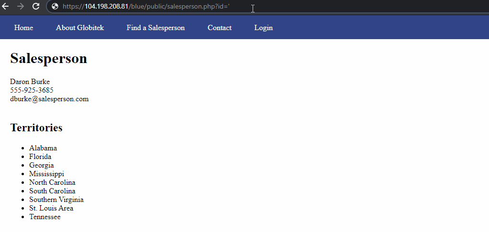
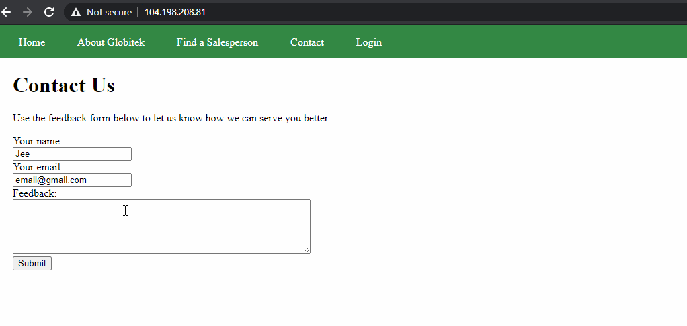
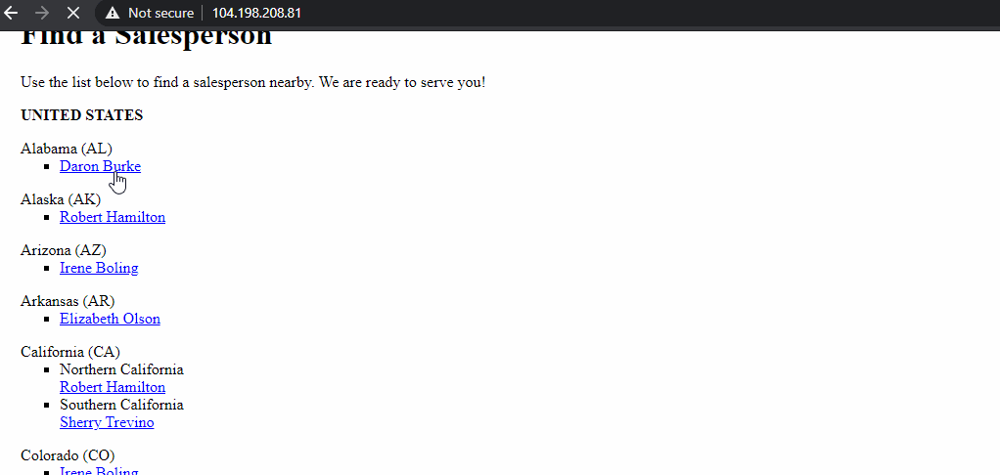

# Project 8 - Pentesting Live Targets

Time spent: **X** hours spent in total

> Objective: Identify vulnerabilities in three different versions of the Globitek website: blue, green, and red.

The six possible exploits are:

* Username Enumeration
* Insecure Direct Object Reference (IDOR)
* SQL Injection (SQLi)
* Cross-Site Scripting (XSS)
* Cross-Site Request Forgery (CSRF)
* Session Hijacking/Fixation

Each color is vulnerable to only 2 of the 6 possible exploits. First discover which color has the specific vulnerability, then write a short description of how to exploit it, and finally demonstrate it using screenshots compiled into a GIF.

## Blue

Vulnerability #1: SQL Injection

Description: Noticed that if we put the "'" character within the url, the server responds in a failed query. Thus this must be the SQL injection.

## Green

Vulnerability #1: XSS

Description: When filling out the contact form, one can use XSS and run unauthorized code when logging in.

## Red

Vulnerability #1: IDOR

Description:

IDs 1-9 can be access through the query params... and are listed in the website.
But these two weren't in the list, but can be accessed.

* ID 10 -> Testy McTesterson 
* ID 11 -> Lazy Lazyman
	

## Notes

Describe any challenges encountered while doing the work
